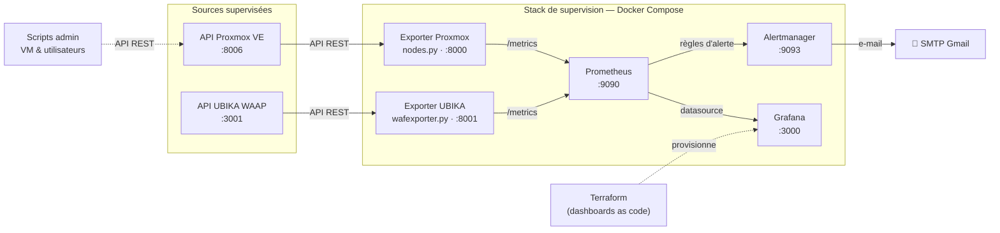

# 🛰️ Titannium — Supervision d'infrastructure Proxmox & WAAP

> Stack d'observabilité complète et conteneurisée pour un cluster **Proxmox VE** et un pare-feu applicatif **UBIKA WAAP Gateway**, s'appuyant sur des **exporters Prometheus développés en Python**, un **alerting** métier par e-mail, et un **provisioning des dashboards Grafana en Terraform** (Infrastructure as Code). Un jeu de **scripts d'administration** pilote en prime le cycle de vie des VM et des utilisateurs via l'API Proxmox.


---

## 📋 Sommaire

- [Aperçu](#-aperçu)
- [Architecture](#-architecture)
- [Stack technique](#-stack-technique)
- [Ce qui est supervisé](#-ce-qui-est-supervisé)
- [Alerting](#-alerting)
- [Infrastructure as Code (Terraform)](#-infrastructure-as-code-terraform)
- [Scripts d'administration Proxmox](#-scripts-dadministration-proxmox)
- [Structure du dépôt](#-structure-du-dépôt)
- [Prérequis](#-prérequis)
- [Démarrage rapide](#-démarrage-rapide)
- [Configuration](#-configuration)
- [Accès aux interfaces](#-accès-aux-interfaces)
- [Sécurité](#-sécurité)
- [Améliorations possibles](#-améliorations-possibles)

---

## 🎯 Aperçu

Ce projet met en place une chaîne de supervision de bout en bout pour un environnement virtualisé, entièrement reproductible :

1. Deux **exporters Python** interrogent les API REST de **Proxmox VE** et de l'**UBIKA WAAP Gateway**, puis exposent les métriques au format Prometheus.
2. **Prometheus** collecte ces métriques et évalue des **règles d'alerte** (saturation RAM/disque/CPU, redémarrages de VM, backend injoignable, pic d'attaques, expiration de licence…).
3. **Alertmanager** regroupe, déduplique et route les alertes vers une **notification e-mail** (SMTP Gmail).
4. **Grafana** visualise les données, ses **dashboards et dossiers étant provisionnés par Terraform**.
5. Un ensemble de **scripts Python** administre le cluster (cycle de vie des VM, gestion des utilisateurs et groupes) via l'API Proxmox.

Réalisé dans le cadre d'un **projet annuel** de Master (équipe *Titannium*).

---

## 🗺️ Architecture



---

## 🧰 Stack technique

| Composant | Rôle | Port |
|-----------|------|------|
| **nodes.py** | Exporter Python custom — métriques des VM Proxmox | `8000` |
| **wafexporter.py** | Exporter Python custom — métriques de l'UBIKA WAAP | `8001` |
| **Prometheus** | Collecte des métriques & évaluation des alertes | `9090` |
| **Alertmanager** | Routage et notification e-mail des alertes | `9093` |
| **Grafana** | Visualisation (dashboards) | `3000` |
| **Terraform** | Provisioning des dossiers & dashboards Grafana | — |

Bibliothèques Python : `prometheus_client`, `requests`, `urllib3`, `python-dotenv`.

---

## 📊 Ce qui est supervisé

### Métriques Proxmox (`nodes.py`)

L'exporter s'authentifie sur l'API Proxmox, parcourt tous les nœuds et toutes les VM QEMU, et expose pour chacune :

| Métrique Prometheus | Description |
|---------------------|-------------|
| `vm_cpu_usage_percent` | Utilisation CPU (%) |
| `vm_memory_used_megabytes` / `vm_memory_total_megabytes` | RAM utilisée / totale (Mo) |
| `vm_disk_used_gigabytes` / `vm_disk_total_gigabytes` | Disque utilisé / total (Go) |
| `vm_network_rx_megabytes` / `vm_network_tx_megabytes` | Trafic réseau reçu / émis (Mo) |
| `vm_uptime_seconds` | Uptime de la VM (s) |

Chaque métrique est étiquetée par `vm_name`. Le collecteur tourne en boucle (ré-authentification + scrape toutes les **30 s**).

### Métriques UBIKA WAAP (`wafexporter.py`)

Disponibilité de l'API, statut des tunnels (backend, écoute, runtime), expiration de licence et volumétrie d'événements de sécurité (`ubika_up`, `ubika_tunnel_backend_status`, `ubika_license_expiry_timestamp_seconds`, `ubika_security_events_last_hour`…).

---

## 🚨 Alerting

Les règles sont définies dans **`alert.rules.yml`**, réparties en deux groupes.

**`proxmox-alerts`**

| Alerte | Condition | Sévérité |
|--------|-----------|----------|
| `VmHighMemoryUsage` | RAM > 85 % pendant 2 min | critical |
| `VmRootDiskLow` | Disque > 90 % pendant 5 min | warning |
| `VmHighCPUUsage` | CPU > 80 % pendant 5 min | warning |
| `VmHighNetworkTraffic` | Débit > 100 Mo/s pendant 5 min | warning |
| `VmRebooted` | Uptime < 5 min | info |
| `ProxmoxExporterDown` | Exporter injoignable | critical |

**`ubika-waap-alerts`**

| Alerte | Condition | Sévérité |
|--------|-----------|----------|
| `WaapApiDown` | API UBIKA injoignable | critical |
| `TunnelBackendDown` | Backend derrière le WAF injoignable | critical |
| `TunnelNotListening` | Tunnel plus en écoute | critical |
| `TunnelRuntimeDegraded` | Runtime en Warning/Error | warning |
| `LicenseExpiringSoon` | Licence expire dans < 30 j | warning |
| `SecurityEventsSpike` | > 50 événements de sécurité / heure | warning |
| `UbikaExporterDown` | Exporter injoignable | critical |

**Routage (`alertmanager.yml`)** : regroupement par `alertname`/`vm_name`/`tunnel`, `group_wait` 30 s, `repeat_interval` 4 h, notification `send_resolved`, et une **règle d'inhibition** (si l'exporter UBIKA est down, l'alerte `WaapApiDown` est supprimée pour éviter le bruit).

---

## 🏗️ Infrastructure as Code (Terraform)

Les dashboards Grafana ne sont pas cliqués à la main : ils sont **versionnés et déployés par Terraform** via le provider `grafana/grafana`.

Points clés de l'implémentation (`main.tf`) :

- **Deux dossiers** Grafana créés en ressources (`Monitoring Infra`, `UBIKA`).
- **Deux dashboards** rendus à partir de templates JSON avec `templatefile()`.
- **Résolution dynamique de l'UID de datasource** : un bloc `data "grafana_data_source"` récupère l'UID réel de la datasource Prometheus et l'injecte dans les templates — les dashboards restent valides même si l'UID change d'un environnement à l'autre (pas d'UID codé en dur).
- `overwrite = true` pour permettre des mises à jour idempotentes.

```bash
cd terraform/
terraform init
terraform plan
terraform apply
```

Variables attendues (`variables.tf`) : `grafana_url`, `grafana_api_key` (marquée `sensitive`), `prometheus_datasource_name`.

> ℹ️ Les templates `dashboards/titannium.json` et `dashboards/ubika_dashboard.json` sont attendus dans le dossier `dashboards/`, avec un placeholder `${datasource_uid}` là où la datasource est référencée.

---

## 🛠️ Scripts d'administration Proxmox

Un jeu de scripts Python autonomes pilote le cluster via l'API Proxmox (authentification par ticket + CSRF token) :

| Script | Rôle |
|--------|------|
| `start_vm.py` | Démarre une VM (`node` + `vmid` en entrée) |
| `stop_vm.py` | Arrête une VM |
| `add_user.py` | Crée un utilisateur (`user@realm` + mot de passe) |
| `add_user_group.py` | Liste utilisateurs/groupes puis ajoute un utilisateur à un groupe |
| `delete_user.py` | Supprime un utilisateur |

Exécution interactive, par exemple :

```bash
python start_vm.py
# > Entrez le nom du node Proxmox :
# > Entrez l'ID de la VM à démarrer :
```

---

## 📁 Structure du dépôt

```
.
├── docker-compose.yml       # Orchestration de la stack de supervision
├── dockerfile               # Image de l'exporter Proxmox (python:3.10-slim)
├── requirements.txt         # Dépendances Python
│
├── nodes.py                 # Exporter Proxmox (métriques VM)
├── wafexporter.py           # Exporter UBIKA WAAP
│
├── prometheus.yml           # Configuration Prometheus (scrape + alerting)
├── alert.rules.yml          # Règles d'alerte Proxmox & UBIKA
├── alertmanager.yml         # Routage / notification e-mail
│
├── terraform/
│   ├── main.tf              # Provisioning Grafana (dossiers + dashboards)
│   ├── variables.tf         # Déclaration des variables
│   ├── terraform.tfvars     # Valeurs (NON versionné — voir .example)
│   └── dashboards/
│       ├── titannium.json
│       └── ubika_dashboard.json
│
├── scripts/                 # Administration Proxmox via API
│   ├── start_vm.py
│   ├── stop_vm.py
│   ├── add_user.py
│   ├── add_user_group.py
│   └── delete_user.py
│
├── .env                     # Secrets exporters (NON versionné)
└── secrets/
    └── smtp_password.txt     # Mot de passe SMTP (NON versionné)
```

> Adapte les chemins si tu préfères garder tous les fichiers à la racine — cette arborescence est une suggestion pour clarifier la lecture du dépôt.

---

## ✅ Prérequis

- **Docker** & **Docker Compose**
- **Terraform** ≥ 1.0 (pour la partie provisioning Grafana)
- Un accès réseau aux API **Proxmox VE** (`:8006`) et **UBIKA WAAP** (`:3001`)
- Un compte SMTP pour la notification e-mail (Gmail avec **mot de passe d'application**)

---

## 🚀 Démarrage rapide

```bash
# 1. Cloner le dépôt
git clone <url-du-repo>.git
cd <repo>

# 2. Créer le fichier .env (voir Configuration)
cp .env.example .env      # puis éditer

# 3. Créer le secret SMTP
mkdir -p secrets
echo "votre_mot_de_passe_application_gmail" > secrets/smtp_password.txt

# 4. Lancer la stack de supervision
docker compose up -d --build

# 5. (Optionnel) Provisionner les dashboards Grafana
cd terraform/
cp terraform.tfvars.example terraform.tfvars   # puis renseigner
terraform init && terraform apply
```

---

## ⚙️ Configuration

### Fichier `.env` (exporters & scripts)

```env
# --- API Proxmox ---
HOST=<ip_ou_fqdn_du_proxmox>
USERNAME=<utilisateur@realm>      # ex : monitoring@pve
PASSWORD=<mot_de_passe>

# --- Grafana (docker-compose) ---
GRAFANA_ADMIN_PASSWORD=<mot_de_passe_admin_grafana>
```

> 💡 Sur Proxmox, préférez un **utilisateur dédié en lecture seule** (rôle `PVEAuditor`) pour la collecte, et un utilisateur à privilèges adaptés pour les scripts d'administration — plutôt que `root@pam`.

### Fichier `terraform.tfvars`

```hcl
grafana_url                = "http://<grafana>:3000"
grafana_api_key            = "<token_service_account_grafana>"
prometheus_datasource_name = "<nom_de_la_datasource>"
```

### Secret SMTP

Le mot de passe SMTP n'est pas dans `alertmanager.yml` : il est lu depuis un fichier monté (`smtp_auth_password_file`). Placez-le dans `secrets/smtp_password.txt`.

---

## 🌐 Accès aux interfaces

| Service | URL |
|---------|-----|
| Prometheus | http://localhost:9090 |
| Grafana | http://localhost:3000 |
| Alertmanager | http://localhost:9093 |
| Exporter Proxmox | http://localhost:8000/metrics |

---

## 🔒 Sécurité

- Ne **jamais versionner** : `.env`, `secrets/smtp_password.txt`, `terraform.tfvars` (contient la clé d'API Grafana), ainsi que le state Terraform (`*.tfstate*`). Voir `.gitignore`.
- La clé d'API Grafana et le token API sont des secrets : utilisez un **Service Account** à privilèges minimaux et régénérez la clé si elle a pu fuiter.
- Le mot de passe SMTP est géré par fichier de secret (bonne pratique Alertmanager).
- Les exporters et scripts désactivent la vérification TLS (`verify=False`) pour s'accommoder des certificats auto-signés du homelab — **à activer** en production avec une CA interne.

---

## 🧭 Améliorations possibles

- Convertir la boucle `time.sleep` des exporters en scheduler plus robuste et remplacer les `print` par des **logs structurés** (`logging`).
- Ajouter une **CI** (lint Python, `promtool check rules`, `terraform fmt/validate`) pour fiabiliser configs et règles.
- Gérer un **backend Terraform distant** (state partagé) plutôt qu'un state local.
- Packager chaque exporter en **Helm chart** pour une migration Kubernetes.
- Factoriser le code d'authentification Proxmox commun aux scripts dans un module partagé.

---

## 👤 Auteur

**Reda** — Master Systèmes, Réseaux & Cloud
Projet annuel · Équipe TitanniumS